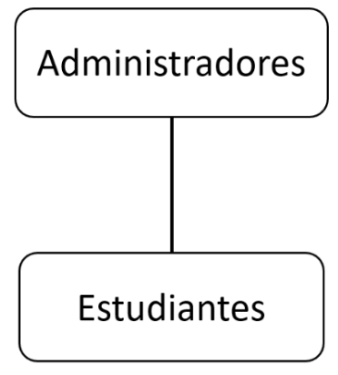

# UNIVERSIDAD PRIVADA DE TACNA  
## FACULTAD DE INGENIERÍA  
### Escuela Profesional de Ingeniería de Sistemas

**Plataforma de análisis de datos de matriculados en la carrera de Ingeniería de Sistemas para la Universidad Privada de Tacna - PAMIS**

Curso: *Inteligencia de Negocios*  
Docente: *Mag. Patrick Cuadros Quiroga*

**Integrantes:**

Agreda Ramirez, Jesus Eduardo  &emsp;&emsp;&emsp;&emsp;- &emsp;  (2021069823)
 Castañeda Centurion, Jorge Enrique &emsp; - &emsp; (2021069822)
 Contreras Lipa Alvaro Javier &emsp;&emsp;&emsp;&emsp;&emsp;&ensp; - &emsp;  (2021070020)
 Malaga Espinoza, Ivan Francisco &emsp;&emsp;&ensp; - &emsp; (2021071086)
 Ortiz Fernandez, Ximena Andrea &emsp;&emsp;&ensp; - &emsp;  (2021071080)

**Tacna – Perú**  
***2024***

\pagebreak

# **Documento de Especidifcaciòn de Requerimientos**

**Plataforma de análisis de datos de matriculados en la carrera de Ingeniería de Sistemas para la Universidad Privada de Tacna - PAMIS**

**Versión 1.0**

## **Control de Versiones**

| Versión | Hecha por | Revisada por | Aprobada por | Fecha      | Motivo           |
| :-----: | --------- | ------------ | ------------ | ---------- | ---------------- |
| 1.0     | JAR       | IME          | XOF          | 27/08/2024 | Versión Original |

\pagebreak

## **Índice General**

 [Introducción](#introducción)  

I. [**Generalidades de la Empresa**](#1)  
   1. Nombre de la Empresa
   2. Visión
   3. Misión
   4. Organigrama 

II. [**Visionamiento de la Empresa**](#2)    
   1. Descripción del Problema
   2. Objetivos de Negocios
   3. Objetivos de Diseño
   4. Alcance del Proyecto
   5. Viabilidad del Sistema
      5.1. Viabilidad Técnica
   6. Información obtenida del Levantamiento de Información

III. [**Análisis de Procesos**](#3)

   a) Diagrama del Proceso Actual - Diagrama de Actividades
   
   b) Diagrama del Proceso Propuesto - Diagrama de Actividades Inicial

IV. [**Especificación de Requerimientos de Software**](#4) 

   a) Cuadro de Requerimientos Funcionales Inicial

   b) Cuadro de Requerimientos No Funcionales

   c) Cuadro de Requerimientos Funcionales Final

   d) Reglas de Negocio

V. [**Fases de Desarrollo**](#5)   
   1. Perfiles de Usuario
   2. Modelo Conceptual

      a) Diagrama de Paquetes

      b) Diagrama de Casos de Uso 

      c) Escenarios de Caso de Uso (Narrativa)

   3. Modelo Lógico

      a) Análisis de Objetos

      b) Diagrama de Actividades con Objetos

      c) Diagrama de Secuencia 

      d) Diagrama de Clases

[Conclusiones](#conclusiones)  
[Recomendaciones](#recomendaciones)  

\pagebreak

## 1. Generalidades de la Empresa 
### 1. Nombre de la Empresa
Universidad Privada de Tacna

### 2. Visión
La visión de la UPT con la plataforma PAMIS es fortalecer la calidad educativa mediante una herramienta analítica que permita a los estudiantes tomar decisiones informadas basadas en datos. La plataforma se alinea con el objetivo institucional de proporcionar una educación personalizada y orientada al éxito académico, apoyando el análisis de datos como pilar fundamental para la mejora continua y la toma de decisiones estratégicas”

### 3. Misión
"La misión de la UPT, a través de PAMIS, es ofrecer una herramienta que facilite el acceso a datos académicos detallados y personalizados para los estudiantes de Ingeniería de Sistemas. Esto busca optimizar su experiencia académica y mejorar su rendimiento, brindando una plataforma que centralice la información académica y reduzca la carga administrativa de la consulta y el manejo de datos.

### 4. Organigrama

Administradores: Nivel superior compuesto por directores de escuela y coordinadores de carrera. Se encargan de optimizar recursos y tomar decisiones estratégicas con base en los datos proporcionados por PAMIS.

Estudiantes: En el nivel base, los usuarios principales de PAMIS, quienes acceden a la plataforma para evaluar su rendimiento, identificar áreas de mejora y tomar decisiones informadas sobre su trayectoria académica.

## Conclusiones

+ PAMIS permite centralizar y optimizar el análisis académico mediante herramientas interactivas que mejoran la toma de decisiones de estudiantes, docentes y administradores.
+ La plataforma resuelve la falta de acceso a estadísticas académicas detalladas, proporcionando gráficos dinámicos y opciones de filtrado que facilitan la exploración de datos relevantes.
+ La integración de Power BI garantiza una experiencia de usuario intuitiva y accesible, reduciendo la carga administrativa y aumentando la eficiencia en la planificación académica.

## Recomendaciones
+ Ampliar el alcance de PAMIS para incluir otras carreras profesionales, potenciando su utilidad en toda la universidad.
+ Incorporar soporte para dispositivos móviles para aumentar la accesibilidad de la plataforma.
+ Realizar actualizaciones continuas basadas en el feedback de los usuarios para mejorar la experiencia y funcionalidad del sistema.
+ Implementar funcionalidades predictivas basadas en inteligencia artificial para proporcionar recomendaciones personalizadas a los estudiantes.