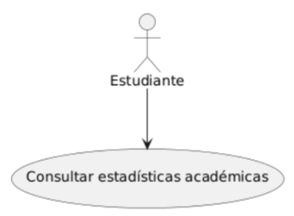
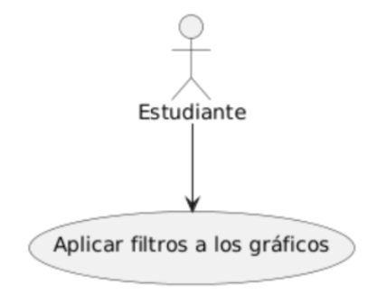
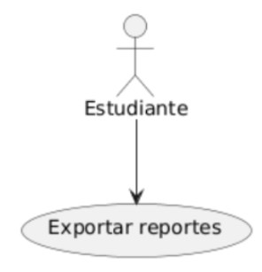

# UNIVERSIDAD PRIVADA DE TACNA  
## FACULTAD DE INGENIERÍA  
### Escuela Profesional de Ingeniería de Sistemas

**Plataforma de análisis de datos de matriculados en la carrera de Ingeniería de Sistemas para la Universidad Privada de Tacna - PAMIS**

Curso: *Inteligencia de Negocios*  
Docente: *Mag. Patrick Cuadros Quiroga*

**Integrantes:**

Agreda Ramirez, Jesus Eduardo  &emsp;&emsp;&emsp;&emsp;- &emsp;  (2021069823)
 Castañeda Centurion, Jorge Enrique &emsp; - &emsp; (2021069822)
 Contreras Lipa Alvaro Javier &emsp;&emsp;&emsp;&emsp;&emsp;&ensp; - &emsp;  (2021070020)
 Malaga Espinoza, Ivan Francisco &emsp;&emsp;&ensp; - &emsp; (2021071086)
 Ortiz Fernandez, Ximena Andrea &emsp;&emsp;&ensp; - &emsp;  (2021071080)

**Tacna – Perú**  
***2024***

\pagebreak

# **Documento de Arquitectura**

**Plataforma de análisis de datos de matriculados en la carrera de Ingeniería de Sistemas para la Universidad Privada de Tacna - PAMIS**

**Versión 1.0**

## **Control de Versiones**

| Versión | Hecha por | Revisada por | Aprobada por | Fecha      | Motivo           |
| :-----: | --------- | ------------ | ------------ | ---------- | ---------------- |
| 1.0     | JAR       | IME          | XOF          | 27/08/2024 | Versión Original |

\pagebreak

## **Índice General**

1. [Introducción](#1)  
   1.1. Propósito  
   1.2. Alcance  
   1.3. Definiciones, Siglas y Abreviaturas  
   1.4. Visión General  

2. [Representación Arquitectónica](#2)  
   2.1. Escenarios  
   2.2. Vista Lógica  
   2.3. Vista del Proceso  
   2.4. Vista de Desarrollo  
   2.5. Vista Física  

3. [Objetivos y Limitaciones Arquitectónicas](#3)  
   3.1. Disponibilidad  
   3.2. Seguridad  
   3.3. Adaptabilidad  
   3.4. Rendimiento  

4. [Análisis de Requerimientos](#4)  
   4.1. Requerimientos Funcionales  
   4.2. Requerimientos No Funcionales  

5. [Vistas de Caso de Uso](#5)  

6. [Vista Lógica](#6)  
   6.1. Diagrama Contextual  

7. [Vista de Procesos](#7)  
   7.1. Diagrama de Proceso Actual  
   7.2. Diagrama de Proceso Propuesto  

8. [Vista de Despliegue](#8)  
   8.1. Diagrama de Contenedor  

9. [Vista de Implementación](#9)  
   9.1. Diagrama de Componentes  

10. [Vista de Datos](#10)  
    10.1. Diagrama Entidad Relación  

11. [Calidad](#11)  
    11.1. Escenario de Seguridad  
    11.2. Escenario de Usabilidad  
    11.3. Escenario de Adaptabilidad  
    11.4. Escenario de Disponibilidad  
    11.5. Otro Escenario  

\pagebreak

## 4. Análisis de Requerimientos 
### 4.1 Requerimientos funcionales
| **Código** | **Requerimiento**                     | **Descripción**                                                                                                                                                                                                                  |
|------------|---------------------------------------|----------------------------------------------------------------------------------------------------------------------------------------------------------------------------------------------------------------------------------|
| RF-01      | Dashboard Interactivo                | La plataforma debe proporcionar un dashboard interactivo en Power BI que permita a los usuarios (estudiantes, docentes y administradores) acceder a estadísticas detalladas de matrícula, rendimiento académico y otros indicadores clave. |
| RF-02      | Visualización de Estadísticas Académicas | La plataforma debe mostrar datos sobre tasas de aprobación, índices de deserción, calificaciones máximas y mínimas, y rendimiento por curso. Los usuarios deben poder visualizar estos datos mediante gráficos, tablas y reportes que faciliten la comprensión de la información. |
| RF-03      | Análisis Comparativo                 | La plataforma debe permitir comparaciones de rendimiento académico entre diferentes cohortes de estudiantes para identificar tendencias y patrones a lo largo del tiempo.                                                          |
| RF-04      | Identificación de Áreas Críticas     | La plataforma debe identificar y destacar los cursos o áreas académicas con altos índices de desaprobación, ayudando a la administración y a los docentes a implementar estrategias de mejora.                                     |
| RF-05      | Exportación de Reportes             | La plataforma debe incluir funcionalidades para que los usuarios puedan exportar reportes en formatos PDF y Excel, permitiendo un análisis posterior fuera de la plataforma.                                                       |
| RF-06      | Filtros y Segmentación              | La plataforma debe permitir que los usuarios apliquen filtros y segmenten los datos en función de criterios específicos, como curso, semestre, año académico y docente.                                                            |
| RF-07      | Generación de Recomendaciones Académicas | La plataforma debe ofrecer recomendaciones y análisis predictivos basados en datos históricos, apoyando a los estudiantes en la toma de decisiones informadas sobre su trayectoria académica.                                      |

### 4.2 Requerimientos no funcionales

| **Código** | **Requerimiento**                  | **Descripción**                                                                                                                                                                              |
|------------|------------------------------------|----------------------------------------------------------------------------------------------------------------------------------------------------------------------------------------------|
| RF-01      | Usabilidad                         | La interfaz de usuario debe ser intuitiva y accesible, permitiendo que usuarios con distintos niveles de experiencia técnica puedan navegar, visualizar datos y generar reportes sin dificultades. |
| RF-02      | Disponibilidad y Fiabilidad        | La plataforma debe estar disponible el 99.5% del tiempo, excluyendo períodos de mantenimiento programado.                                                                                     |
| RF-03      | Seguridad de Datos                 | La plataforma debe cumplir con la Ley de Protección de Datos Personales en Perú, asegurando la confidencialidad y privacidad de los datos académicos y personales de los estudiantes.           |
| RF-04      | Compatibilidad                     | La plataforma debe ser accesible desde entornos de escritorio, funcionando en sistemas operativos Windows y macOS, y ser compatible con los navegadores más utilizados (Google Chrome, Mozilla Firefox, Microsoft Edge). |
| RF-05      | Recuperación Rápida ante Fallos e Interrupciones | La plataforma debe de recuperarse de manera muy rápida frente a fallos e interrupciones.                                                                                                     |
| RF-06      | Interactividad y Visualización de Datos | La plataforma debe permitir una visualización precisa y flexible, con filtros personalizables y segmentación de datos aplicable en un 95% de las consultas realizadas.                        |

## 5. Vistas de Caso de Uso 
**Escenarios de Caso de Uso de la aplicación “PAMIS”**

**Diagrama de CU01 “Consultar estadísticas académicas”**

El estudiante es el actor que interactúa con el sistema para acceder a las estadísticas académicas

**Diagrama de CU02 “Aplicar filtros a los gráficos”**

El estudiante selecciona filtros para personalizar los gráficos, como semestres, cursos, o indicadores académicos.

**Diagrama de CU03 “Exportar reportes”**

El estudiante puede exportar los reportes generados en diferentes formatos.

